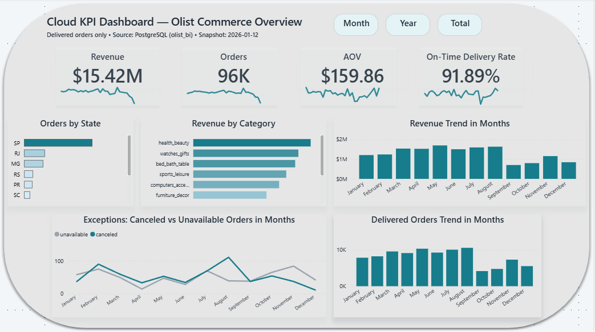
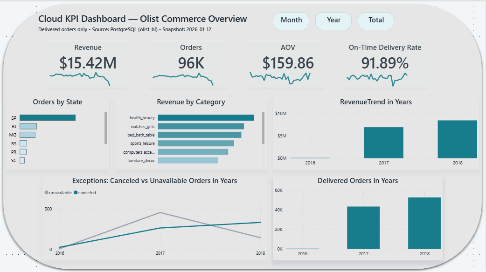
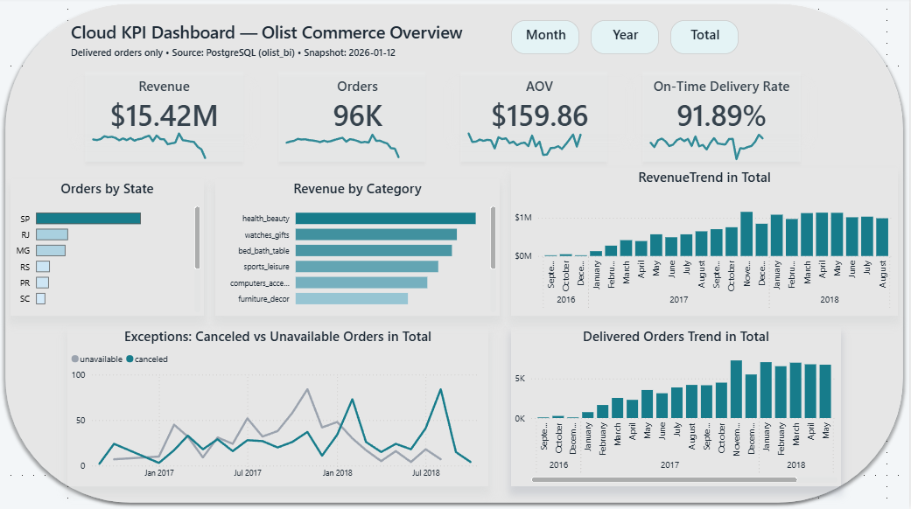
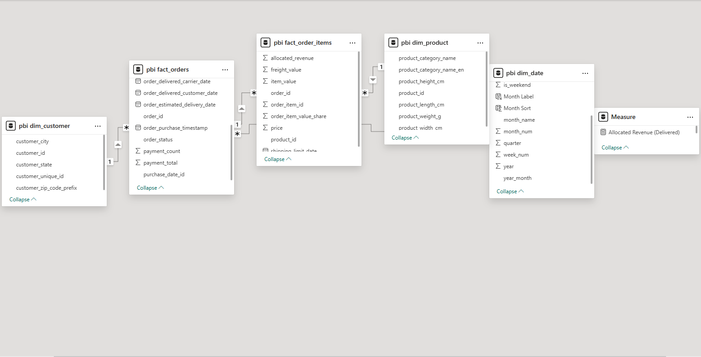
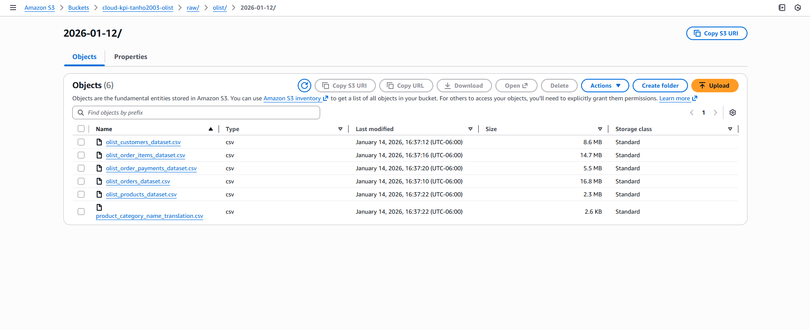

# Cloud KPI Reporting Pipeline (AWS S3 → Curated → Postgres → Power BI)

## Purpose
Build a production-style KPI reporting pipeline that ingests raw commerce data, validates data quality, curates clean dimensional tables, loads into PostgreSQL, and powers a Power BI executive dashboard.

## Dataset
Olist Brazilian E-Commerce Public Dataset (snapshot: 2026-01-12)

## Architecture
Raw CSVs (S3) → Data Quality Gate → Curated Star Schema (CSV) → PostgreSQL (schema: bi) → Power BI Dashboard

Postgres DB: `olist_bi` | Schema: `bi` (Power BI connects to `pbi.*` views)

## Highlights (Proof)
- Delivered orders: **96,478**
- Delivered revenue (SUM(payment_total)): **15,422,605.23 BRL**
- AOV: **159.86 BRL**
- On-time delivery rate: **91.89%**
- Postgres validation: **100%** join completeness (orders → customers, items → products)

## Power BI Dashboard

### Month


### Year


### Total


## Data Model


## AWS S3 Storage (Raw/Bronze → Curated/Silver)
- s3://cloud-kpi-tanho2003-olist/raw/olist/2026-01-12/
- s3://cloud-kpi-tanho2003-olist/curated/olist/2026-01-12/
- s3://cloud-kpi-tanho2003-olist/reports/data_quality/



## KPIs
See: [KPI Definitions](docs/KPI_Definitions.md)

## Data Model (Star Schema)
Facts:
- fact_orders (order-level)
- fact_order_items (item-level)

Dimensions:
- dim_date
- dim_customer
- dim_product

See: [Data Dictionary](docs/Data_Dictionary.md)

## Data Quality Checks (Hire-Ready Differentiator)
- DQ gate enforces schema, PK uniqueness, missing thresholds, range checks, referential integrity, and allocation sanity.
- Sample report: [DQ Report](reports/data_quality/data_quality_report_2026-01-12.md)

## Raw → Curated Row Counts (2026-01-12)
| Layer | Table | Rows |
|---|---|---:|
| Raw | orders | 99,441 |
| Raw | order_items | 112,650 |
| Raw | order_payments | 103,886 |
| Curated | dim_date | 800 |
| Curated | dim_customer | 96,096 |
| Curated | dim_product | 32,951 |
| Curated | fact_orders | 99,441 |
| Curated | fact_order_items | 112,650 |

## Load Validation (Postgres)
- Row counts match curated outputs
- Join completeness:
  - orders → customers: 100%
  - items → products: 100%
- Delivered orders: 96,478
- Delivered revenue (SUM(payment_total)): 15,422,605.23 BRL

## Quickstart

### 1) Build curated tables (local)
```bash
pip install -r requirements.txt
# Run the notebook:
# notebooks/06_build_curated.ipynb

### 2) Load curated tables into Postgres (Windows)
```powershell
# First run (create + load + views)
$psql = "C:\Program Files\PostgreSQL\18\bin\psql.exe"
& $psql -U postgres -d olist_bi -f sql/07_create_tables.sql
& $psql -U postgres -d olist_bi -f sql/07_load_csv_psql.sql
& $psql -U postgres -d olist_bi -f sql/08_powerbi_views.sql

# Refresh run (truncate + reload)
& $psql -U postgres -d olist_bi -f sql/07_truncate_tables.sql
& $psql -U postgres -d olist_bi -f sql/07_load_csv_psql.sql
```

### 3) Power BI
Connect Power BI to Postgres database `olist_bi` and load `pbi.*` views.

### 4) Upload to S3 (AWS CLI)
```bash
aws s3 sync data/raw/olist/2026-01-12 s3://cloud-kpi-tanho2003-olist/raw/olist/2026-01-12/
aws s3 sync data/curated/olist/2026-01-12 s3://cloud-kpi-tanho2003-olist/curated/olist/2026-01-12/
aws s3 cp reports/data_quality/data_quality_report_2026-01-12.md s3://cloud-kpi-tanho2003-olist/reports/data_quality/
```

## Notes / Known Edge Cases
- 1 delivered order missing payment rows; patched payment_total using SUM(price + freight) and logged in DQ report.
- Product category EN translation coverage is not 100%; missing values remain null.
